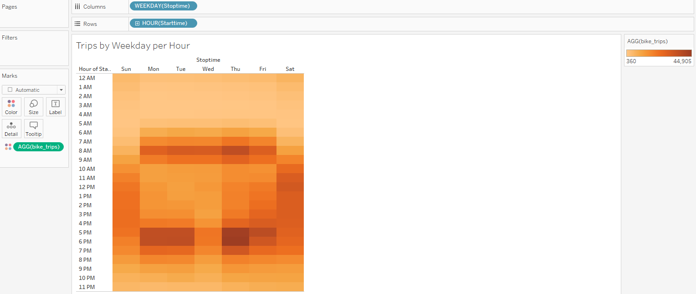

# Citi Bike Share - Aug 2019 Analysis

## Overview of the analysis: 

Get buy in from investors that a bike-sharing program in Des Moines is a solid business proposal.  Used CitiBike Sharing information from NYC - August of 2019 to support this bikesharing model in Des Moines.

## Results: 

Click to view Tableau Visualizations - [link to dashboard](https://public.tableau.com/app/profile/gilda.juarez/viz/Citi_Bike_Trip_Visualization_Analysis/Bike_SharingStory?publish=yes)

* The trip duration for most users in the month August 2019 was 5 minutes with a total of 146,752 users.

* The largest population to use bikes are 108,087 which are male riders with an avaerage ride duration of 5 minutes.

* This heat map demonstrates that the most usuage on an average week in August 2019 were commuter hours, between 7 AM and 10 AM and high usage again during 5 PM and 7 PM Monday through Friday.  Weekend usage peaked between 11 AM and 6 PM, which shows it could be used for leisure over the weekend.

* This heat map shows usage by gender, as seen in the image above commuter hours are highest, but the volume of rides is seen higher in male riders versus female riders.

* Data reflected in this heat map shows that subscribers use the service much more than an average customer.  As the other data supports, Male riders during commuter hours are the largest users of this services. This also shows an opporunity to find more ways to engage use over the weekends.

## Summary: 

Based on all the data provided above, there are 2 more data points that support the use of bike sharing in Des Moines.

* Des Moines is a larger city that can support the need for commuting like New York City.
* Additionally, Des Moines is a business hot spot that attracts many large companies and organizations.  There would be plenty of the right demographic to support the business model.

In addition to the data shown above, there are 2 more data sets that support the commuter demographic, as well as the subscriber business model.

* The bar graph shows the amount of bike trips during the commuter hours and its peak time being 7 AM - 9 AM & 5 PM -  7PM as also seen in the heat map above. 

* The pie chart below shows the relationship between subscriber and customer.  The majority of the users are subscribers and repeat users - which means there is an opportuity to not only increase the user base, but also find different marketing techniques to reach guest customers.

